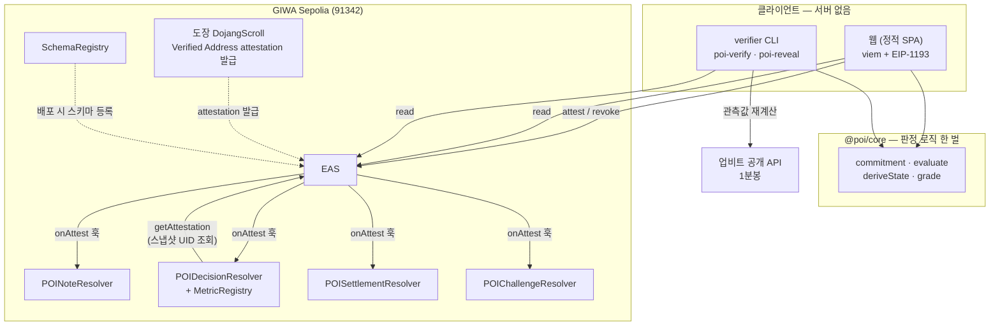

# 시스템 아키텍처

POI는 **자체 서버가 없습니다.** 브라우저와 CLI가 RPC로 체인을 직접 읽고,
쓰기는 사용자 지갑이 EAS에 직접 보냅니다.



> **리졸버는 도장 컨트랙트를 직접 호출하지 않습니다.** 결정에 담긴 스냅샷 UID로
> EAS attestation을 조회해 recipient가 본인인지, 철회·만료되지 않았는지만 검사합니다.
> `SchemaRegistry`도 발행 경로가 아니라 배포 시 스키마를 등록하는 경로입니다.

## 왜 `core`가 한 벌인가

프론트와 검증기가 각자 판정 로직을 구현하면 **언젠가 어긋나고, 그때 무엇이 맞는지
알 수 없게 됩니다.** 그래서 `@poi/core` 하나만 두고 둘 다 그것을 씁니다.

commitment는 한 발 더 나갑니다 — **테스트 벡터 파일 하나를 Solidity 테스트와
TypeScript 테스트가 함께 읽습니다.** 컨트랙트와 클라이언트가 갈라지면 테스트가 먼저 깨집니다.

```
core/vectors/commitment.v1.json
  ├─ contracts/test/CommitmentVector.t.sol   (forge)
  └─ core/test/commitment.test.ts            (node)
```

## 신뢰 이동 경로

| 단계 | 누가 | 어디에 |
|---|---|---|
| 결정 커밋 | 사용자 지갑 | EAS → DecisionResolver 검사 |
| 관측 | 누구나 | 업비트 공개 API (오프체인) |
| 결과 등록 | 결정 소유자 | EAS → SettlementResolver가 산술 재계산 |
| 이의 | 제3자 지갑 | EAS → ChallengeResolver |
| 검증 | 누구나 | RPC 읽기 + 업비트 재계산 |

**서버가 없다는 것이 곧 검열·조작 지점이 없다는 뜻입니다.** 화면을 내려도
체인의 기록과 `verifier` CLI는 그대로 동작합니다.
