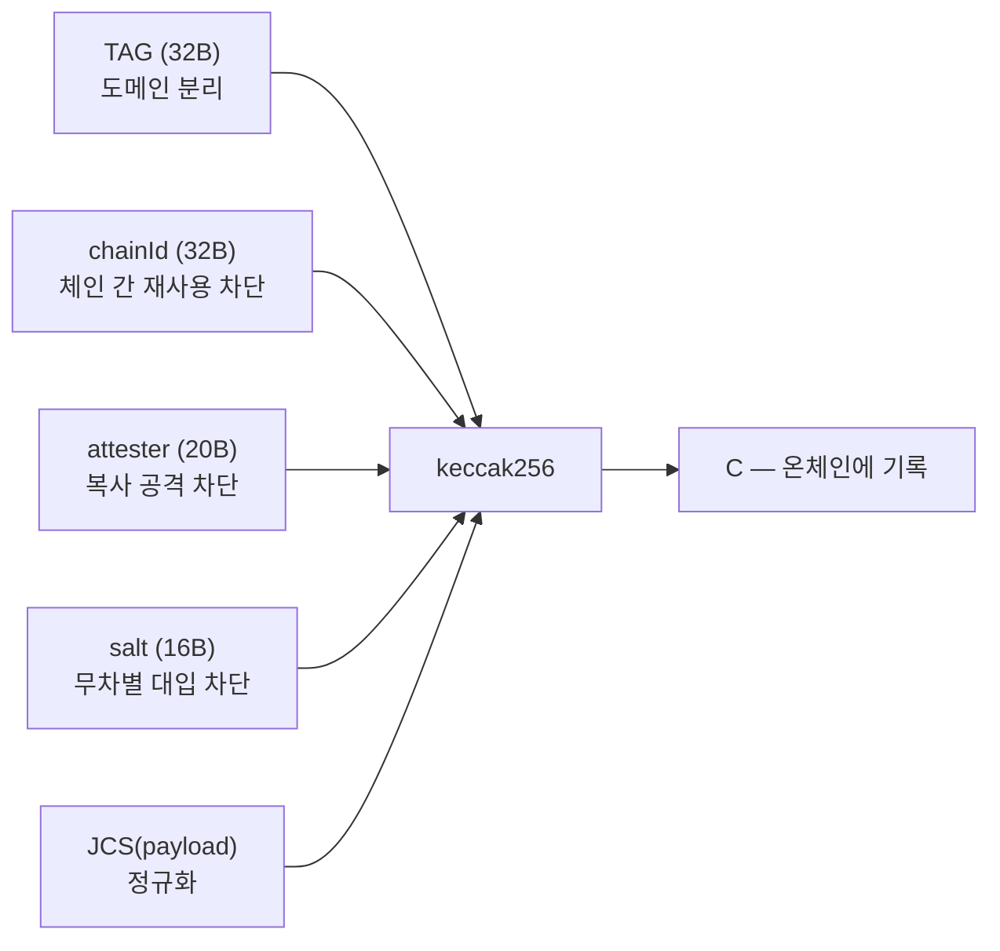
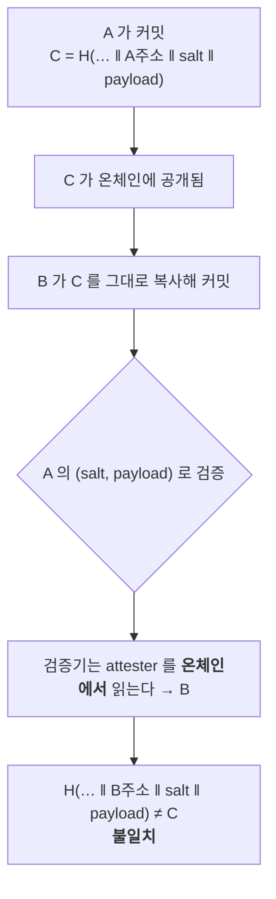

# commitment 설계와 복사 공격

```
C = keccak256( TAG ‖ CHAIN_ID ‖ ATTESTER ‖ salt ‖ JCS(payload) )
```

| 요소 | 정의와 역할 |
|---|---|
| `TAG` | 32바이트 도메인 태그. 결정·트리거·근거·이유의 공간 분리 |
| `CHAIN_ID` | `uint256` big-endian. 다른 체인에서의 재사용 차단 |
| `ATTESTER` | 20바이트 발행 지갑 주소. 복사 공격 차단 |
| `salt` | 16바이트 CSPRNG. 짧은 payload의 무차별 대입 차단 |
| `JCS` | RFC 8785 정규화 JSON, UTF-8 |

Alice의 commitment를 Bob이 그대로 복사해도 Alice의 `(salt, payload)`로 Bob의
commitment를 검증하면 불일치합니다. commitment가 attester에 결속되기 때문입니다.

검증 도구는 attester를 입력받지 않고 온체인에서 읽습니다. 구현 세 곳은
`core/vectors/commitment.v1.json`의 같은 테스트 벡터를 사용합니다.

## 프리이미지 구조



## 왜 복사가 실패하는가 (CT18)



**검증 도구가 attester 를 입력받지 않는 것이 핵심입니다.**
입력받게 만들면 공격자가 원래 attester 를 타이핑해 거짓 일치를 만들 수 있습니다.
