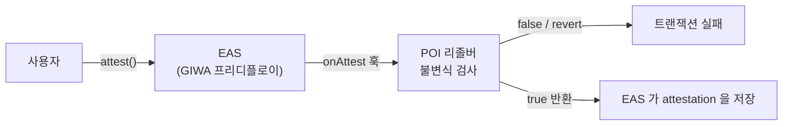

# 컨트랙트 불변식

POI의 앵커는 새 레지스트리가 아니라 **EAS SchemaResolver**입니다.

```
사용자 → EAS.attest() → [POI 리졸버가 불변식 검사] → 통과해야 기록됨
```

| 리졸버 | 스키마 | revocable | 역할 |
|---|---|---|---|
| `POINoteResolver` | `poi.note.v1` | ✗ | 시점만 고정하는 노트 |
| `POIDecisionResolver` | `poi.decision.v1` | ✗ | 결정 + 예상 결과. 지표 레지스트리 겸함 |
| `POISettlementResolver` | `poi.settlement.v1` | ✓ | 결과 등록 |
| `POIChallengeResolver` | `poi.challenge.v1` | ✓ | 이의 |

**I4 — 관측 구간을 과거로 설정할 수 없습니다.**

```solidity
if (d.windowStart < attestTime) revert WindowInPast();
```

**I17 — 정산 결과를 발행자가 정할 수 없습니다.**

```solidity
uint8 expect = _eval(d.outcomeOp, s.observedValue, d.outcomeThreshold) ? 0 : 1;
if (s.result != expect) revert ResultMismatch();
```

I8은 관측 시각을 관측 구간의 끝으로 고정하고, I7은 구간 종료 전 정산을 막습니다.
I2는 부모가 자식보다 엄격히 빠르도록 하고, I3은 같은 지갑의 결정만 부모로 허용합니다.

전체 목록은 [불변식 전체 목록](../appendix/invariant-list.md)에 있습니다.

## 리졸버가 붙는 자리



새 레지스트리를 만들지 않습니다. 조회·철회·참조는 EAS 표준을 그대로 씁니다.
