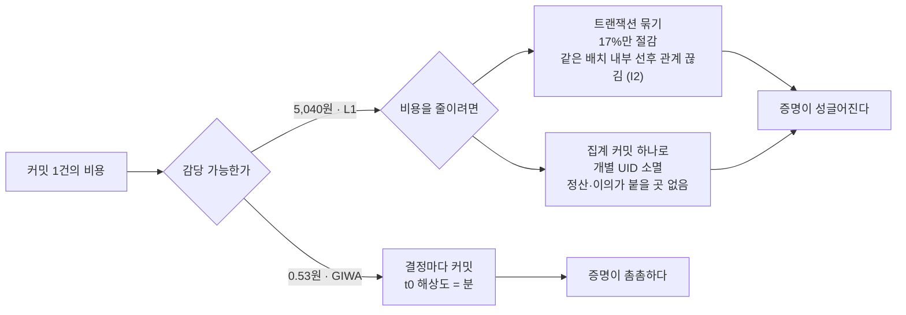

# 비용

> 2026-07-27 GIWA Sepolia의 **가스 가격은 실측**입니다. gas 사용량과 환율은
> 가정이며, 아래 원화 비용은 **추정치**입니다. 테스트넷 기준이고 메인넷 L1 데이터
> 수수료는 이더리움 blob 가격에 따라 변동합니다.

```
L2 가스 가격     0.001 gwei
결정 커밋        약 120,000 gas  →  L2 0.50원 + L1 데이터 0.03원 ≈ 0.53원
노트 발행        약  80,000 gas  →  약 0.34원
정산 발행        약 150,000 gas  →  약 0.63원

가정: ETH $3,000 / 1,400원. gas 사용량은 추정치.
```

비용이 커밋 빈도를 정하고, 커밋 빈도가 t0의 해상도를 정합니다.

## 비용이 시점 해상도를 정한다



> 수치는 추정입니다 — 가스 가격만 실측이고 gas 사용량(120,000)과
> 환율(ETH $3,000 / 1,400원), L1 예시 10 gwei 는 가정입니다.
