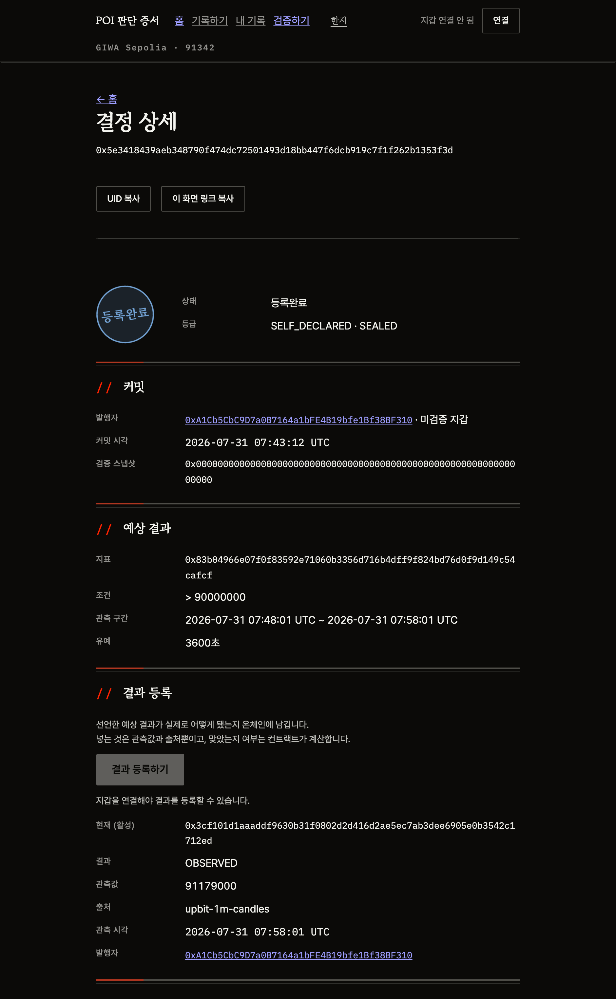
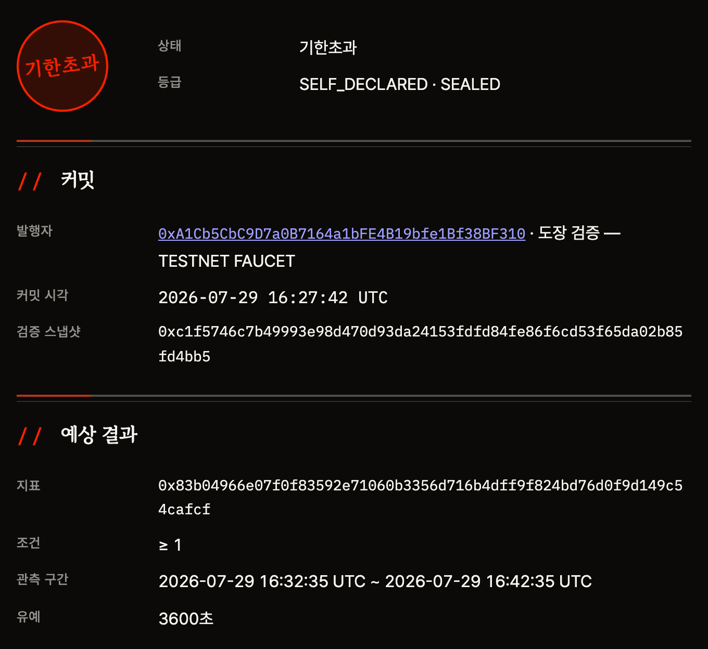

# 무엇을 하는 제품인가

**투자 판단을 결과가 나오기 전에 온체인에 고정하고, 그 판단이 맞았는지를
발행자가 아니라 컨트랙트가 계산해 강제합니다.**

투자에서 남는 건 거래 기록이지 판단이 아닙니다. 얼마에 사서 얼마에 팔았는지는
거래소에 남지만, **왜 그렇게 판단했는가는 아무 데도 남지 않습니다.**
그래서 결과를 본 뒤에 「나는 그럴 줄 알았다」고 말하는 것을 막을 방법이 없습니다.

---

## 왜 지금까지 안 됐나

기록 수단이 없어서가 아닙니다. **있는 수단이 전부 사후에 고칠 수 있기 때문입니다.**

| | 무엇이 남나 | 왜 증거가 못 되나 |
|---|---|---|
| 트레이딩 저널 | 판단과 이유 | 본인이 언제든 고칠 수 있습니다 |
| SNS · 커뮤니티 글 | 판단 | 지우면 그만입니다. 지운 사람과 안 지운 사람이 화면에서 구별되지 않습니다 |
| 리더보드 · 수익률 | 성과 | 판단이 안 보입니다. 어떤 판단이 그 성과를 만들었는지 모릅니다 |
| 캡처 · 스크린샷 | 무엇이든 | 만들 수 있습니다 |

POI 가 바꾸는 것은 기록의 **양**이 아니라 **시점과 주체**입니다 —
결과를 알기 전에 고정하고, 맞았는지는 본인이 아니라 컨트랙트가 판정합니다.

---

## 어떻게 작동하나

```
t0                     t1                  t2
결정 커밋              관측 구간 종료         결과 등록
──────────────────────────────────────────────────
내용은 해시로만        관측값 확정          컨트랙트가 판정
관측 구간 선언                             발행자가 아니라
                                          컨트랙트가 계산
```

세 가지가 이 구조를 지탱합니다.

| | |
|---|---|
| **관측 구간을 과거로 못 잡는다** | 커밋 시각보다 뒤여야 합니다 (`I4`). 지나간 구간을 골라 「맞혔다」고 할 수 없습니다 |
| **정산 산술을 컨트랙트가 강제한다** | 발행자가 낸 관측값으로 컨트랙트가 다시 계산합니다. 어긋나면 트랜잭션이 되돌아갑니다 (`I17`) |
| **지표 정의가 고정돼 있다** | 무엇을 어떻게 잴지가 문서 바이트 해시로 온체인에 박혀 있습니다. 나중에 기준을 바꿀 수 없습니다 |

결정은 철회할 수 없습니다. 정산과 이의는 정정할 수 있고, **그 이력이 화면에 남습니다.**

---

## 실제 기록 한 건

지금 체인에 있는 결정을 그대로 따라가 봅니다. 지어낸 예시가 아니라
[GIWA Sepolia 에 있는 기록](deployed.md)이고, 아래 화면은 그 결정을 연 것입니다.



| | 무엇이 남았나 |
|---|---|
| **t0** 커밋 | 본문은 해시로만. 무엇을 볼지는 평문으로 선언 — `BTC_PRICE_KRW_AT_END > 90,000,000`, 구간 10분 |
| | 이 구간은 **커밋 시각보다 뒤**여야 합니다 (`I4`). 지나간 구간을 고를 수 없습니다 |
| **t1** 구간 종료 | 업비트 공개 1분봉으로 관측값이 확정됩니다 — **91,179,000** |
| | 공개 데이터라 **누구나 같은 값을 다시 구할 수 있습니다** |
| **t2** 결과 등록 | 발행자가 낸 관측값으로 **컨트랙트가 다시 계산합니다.** `91,179,000 > 90,000,000` 이므로 「맞음」 |
| | 발행자가 「틀림」이라고 적어 제출하면 트랜잭션이 되돌아갑니다 (`I17`) |

```
결정  0x5e3418439aeb348790f474dc72501493d18bb447f6dcb919c7f1f262b1353f3d
정산  0x3cf101d1aaaddf9630b31f0802d2d416d2ae5ec7ab3dee6905e0b3542c1712ed
```

오프체인 검증기로 돌리면 `MATCH` 와 종료코드 `0` 이 나옵니다. 절차는
[5분 만에 직접 확인하기](verify-in-5-min.md)에 있습니다.

> **이 결정은 「미검증 지갑」으로 발행됐습니다.** 화면의 검증 스냅샷이 `0x000…` 인 것이
> 그것입니다. 도장 검증을 붙인 예시는 [배포된 주소와 UID](deployed.md)의 O7 fixture 에 있습니다.
> 숨기지 않고 화면에 그대로 띄우는 것이 이 제품의 방식입니다.

---

## 결과를 안 올리면 어떻게 되나



**선언해 놓고 결과를 올리지 않으면 인장이 「기한초과」로 바뀝니다.**
발행자가 지우거나 감출 수 없습니다. 미발행을 드러내는 것이 이 제품의 태도입니다.

화면 구조 전체는 [화면](../usage/screens.md), 전체 흐름은 [흐름](../usage/flow.md)에 있습니다.
**지갑 없이 조회·검증이 됩니다.**

---

## 무엇을 보장하고 무엇을 안 하나

| | |
|---|---|
| **컨트랙트가 강제** | 관측 구간이 커밋 이후다 · 정산 산술이 관측값과 일치한다 · 결정 간 선후 관계 · 지표 정의가 고정돼 있다 |
| **소유자가 제출** | 관측값 자체 — 제3자가 재현하고, 다르면 이의를 온체인에 남깁니다 |
| **보장하지 않음** | 관측값의 진실성 · 이유의 진실성 · 실제 거래와의 정합성 · 기록의 완전성 |

> **발행자에게 남는 자유는 관측값 하나뿐입니다.** 그 값이 참인지는 컨트랙트가
> 보장하지 않습니다. 대신 공개 데이터로 재현할 수 있게 만들고, 어긋나면 이의가
> 영구히 남게 했습니다. 자세한 경계는 [신뢰 경계](../problem/trust-boundary.md)에 있습니다.

---

## 하지 않는 것

**「누가 더 잘하는가」가 아니라 「이 판단이 언제 있었고 무엇을 말했는가」만 다룹니다.**

- **종목 추천 · 자동매매 · 카피트레이딩** — 투자자문업·투자일임업 등록이 필요한 영역입니다.
  POI 는 등록 금융투자업자가 아니라 기록 인프라입니다
- **성과 랭킹 · 수익률 공개 · 판단 품질 점수** — 기록의 완전성을 보장하지 못하는데
  그 위에 순위를 세우면 순위가 거짓말이 됩니다

제도상 못 하는 것과 설계로 뺀 것을 나눠 적은 것은 [POI 가 하지 않는 것](../README.md)에 있습니다.
