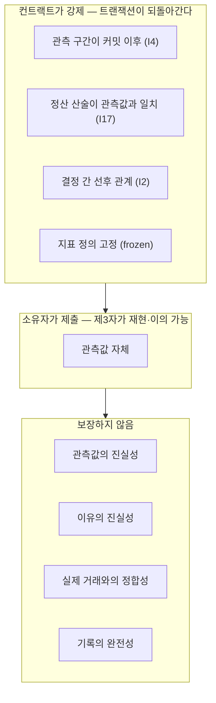

# 신뢰 경계

> POI가 실제로 보장하는 것은 **"이 바이트가 그 시점 이전에 존재했다"** 입니다.
> 그 이상을 주장하지 않습니다.

| | |
|---|---|
| **컨트랙트가 강제** | 관측 구간이 커밋 이후다 · 정산 산술이 관측값과 일치한다 · 결정 간 선후 관계 · 지표 정의가 고정돼 있다 |
| **소유자가 제출** | 관측값 자체 (제3자가 재현·이의 가능) |
| **보장하지 않음** | 관측값의 진실성 · 이유의 진실성 · 실제 거래와의 정합성 · 기록의 완전성 |

MVP에서 정산은 결정 소유자가 외부 데이터로 판정해 발행합니다. 출처·관측 시각·
로직 버전을 함께 기록하므로 제3자가 같은 절차로 결과를 재현할 수 있고,
불일치 시 Challenge로 영구 기록할 수 있습니다.

지금 있는 것은 **재현 가능성 + 이의 가능성**입니다. 독립 판정은 Phase 2 오라클의
영역이며, MVP를 탈중앙 검증이라고 부르지 않습니다.
