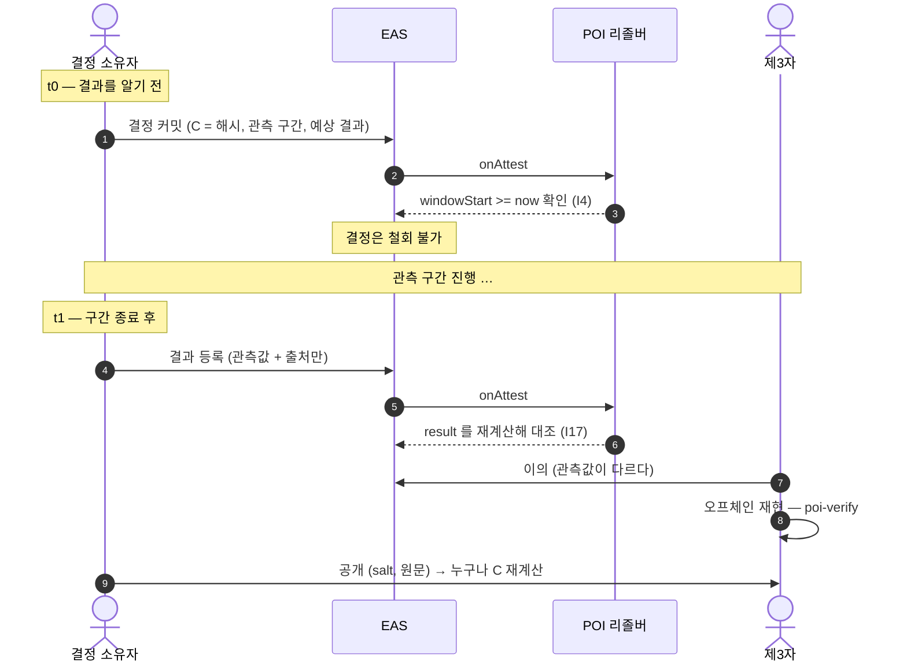

# 커밋 → 결과 등록 → 이의 → 공개




```
t0   COMMIT     salt ← CSPRNG(128)
                C = H(TAG ‖ chainId ‖ attester ‖ salt ‖ JCS(payload))
                온체인: C + outcome predicate + window

t1   SETTLE     소유자 발행. 온체인이 결과 판정을 검증

t1+  CHALLENGE  관측값·출처에 대한 이의 (누구나)

t1+  REVEAL     (salt, payload) 공개 → 누구나 C 재계산 (선택)
```

결정 커밋은 철회할 수 없습니다. 결과 등록은 결정 소유자가 발행하며, 관측값과
모순되는 `result`는 컨트랙트가 거부합니다. 다른 지갑은 활성 결과 등록에 이의를
발행할 수 있습니다. 공개는 정산의 전제가 아니라 선택 사항입니다.
