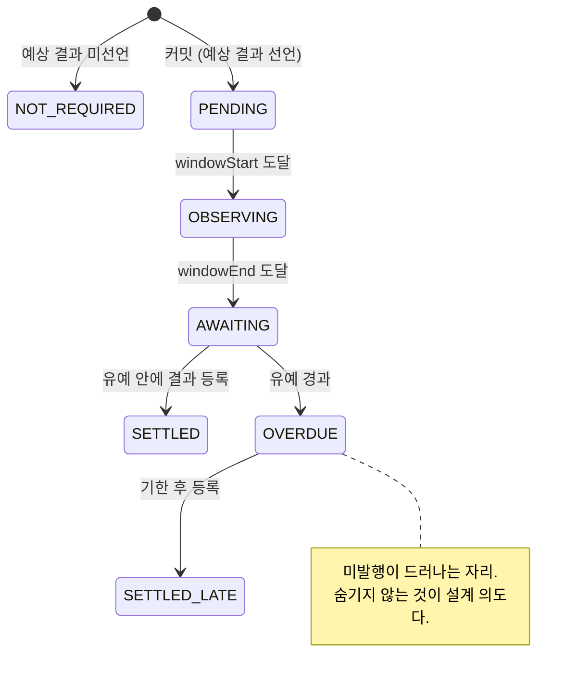

# 화면 구조

| 화면 | 확인할 내용 |
|---|---|
| 홈 `#/` | 서비스 소개, 기록 열기, 예시 증서. 지갑 없이 공개 조회 |
| 상세 `#/d/<uid>` | 커밋, 예상 결과, 결과 등록, 이의, 공개, 계보, 검증 근거 |
| 기록 발행 `#/record` | 저널 저장 → 노트 승격 → 결정 커밋 |

상세 화면에는 `대기` → `관측중` → `등록대기` → `기한초과`의 시간 상태,
활성 결과 등록과 철회 이력, 이의 목록이 표시됩니다. 이의 건수나 적중률 같은
집계 숫자는 표시하지 않습니다.

Salt 백업을 완료하기 전에는 결정 발행이 비활성입니다. 없는 해시 경로에는
`"없는 화면입니다."`가 표시되고, 딥링크·새로고침·뒤로가기는 hash route를 유지합니다.

## 인장 7상태 전이

| 상태 | 화면 문구 |
|---|---|
| `NOT_REQUIRED` | 해당없음 |
| `PENDING` | 대기 |
| `OBSERVING` | 관측중 |
| `AWAITING` | 등록대기 |
| `OVERDUE` | **기한초과** |
| `SETTLED` | 등록완료 |
| `SETTLED_LATE` | 지연등록 |
