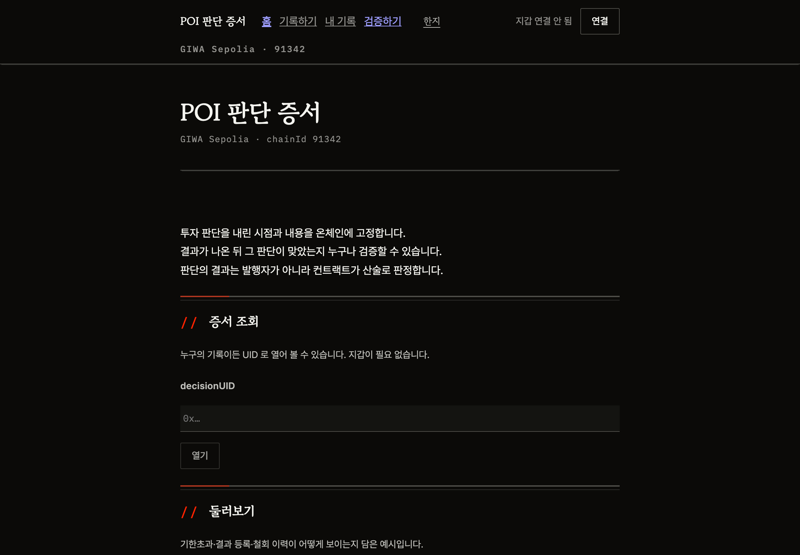
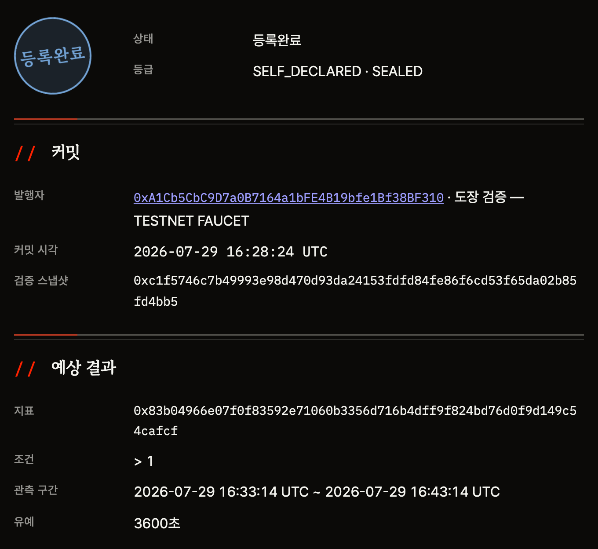
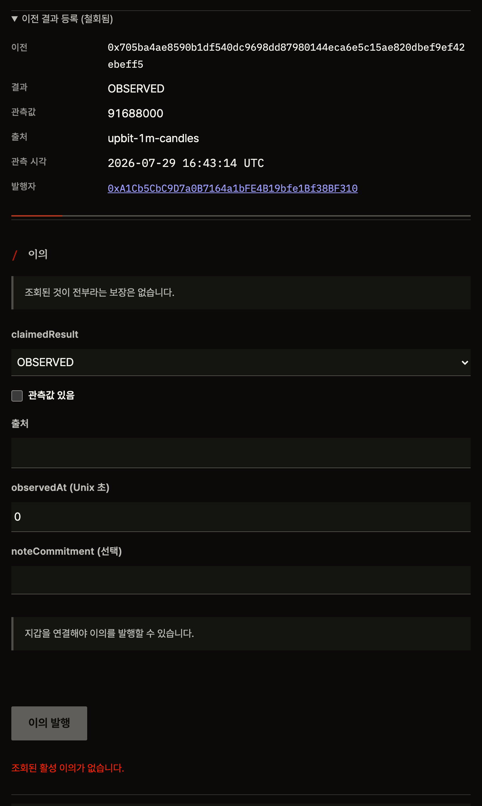
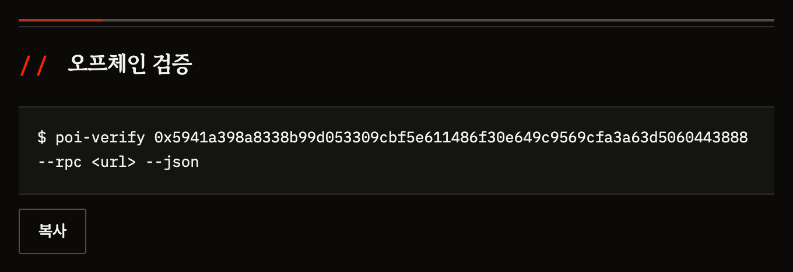
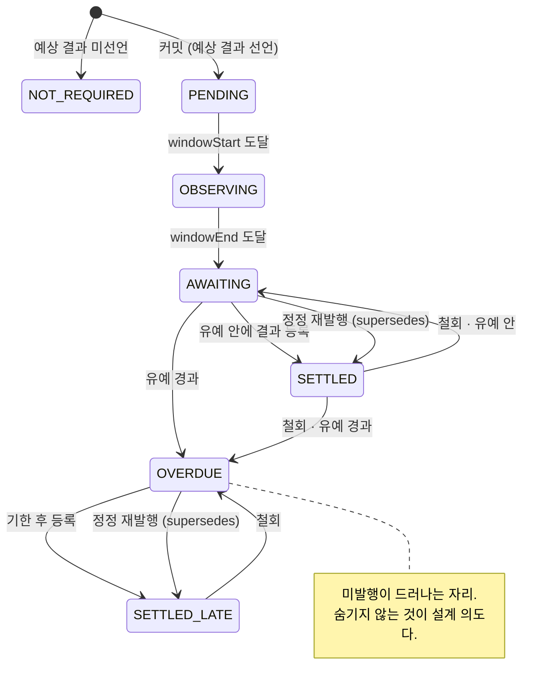

# 화면 구조

> **인장** = 화면에 찍히는 상태 도장. **유예**(`graceSeconds`) = 구간이 끝난 뒤
> 결과 등록을 기다려 주는 시간. 나머지는 [용어집](../appendix/glossary.md)에 있습니다.

> 아래 캡처는 전부 **공개 URL 의 실제 화면**입니다 —
> [poi-static-production.up.railway.app](https://poi-static-production.up.railway.app).
> 지갑 없이 같은 화면을 직접 열어 보실 수 있습니다.

| 화면 | 확인할 내용 |
|---|---|
| 홈 `#/` | 서비스 소개, 기록 열기, 예시 증서. 지갑 없이 공개 조회 |
| 상세 `#/d/<uid>` | 커밋, 예상 결과, 결과 등록, 이의, 공개, 계보, 검증 근거 |
| 기록 발행 `#/record` | 저널 저장 → 노트 승격 → 결정 커밋 |

상세 화면에는 `대기` → `관측중` → `등록대기` → `기한초과`의 시간 상태,
활성 결과 등록과 철회 이력, 이의 목록이 표시됩니다. 이의 건수나 적중률 같은
집계 숫자는 표시하지 않습니다.

Salt 백업을 완료하기 전에는 결정 발행이 비활성입니다. 없는 해시 경로에는
`"없는 화면입니다."`가 표시되고, 딥링크·새로고침·뒤로가기는 hash route를 유지합니다.

## 홈 — 지갑 없이 들어오는 자리

소개 3줄과 `증서 조회`, `둘러보기`가 전부입니다.
**총 개수·비율·적중률 같은 집계 숫자는 어디에도 없습니다** — 선택적 기록으로
만든 순위는 거짓말이 되기 때문입니다([가장 큰 한계](../limits/not-yet.md)).

## 상세 — 기한초과

예상 결과를 선언해 놓고 결과를 올리지 않으면 인장이 **「기한초과」**가 됩니다.
아래에 **커밋 당시 선언한** 지표·조건·관측 구간이 커밋 시각과 함께 남습니다 —
결과를 본 뒤에 바꿀 수 없습니다(`I4`).

발행자 옆의 **「도장 검증 — TESTNET FAUCET」**은 검증 스냅샷이 붙은 결정이라는 뜻입니다.
발급자 라벨을 그대로 보여줍니다 — 「업비트 KYC 검증」과 뭉뚱그리지 않습니다.

## 상세 — 등록완료

등급이 **두 축**입니다. `SELF_DECLARED`(누가 말했나)와 `SEALED`(내용이 공개됐나)는
다른 질문이라 하나로 합치지 않습니다 — 합치면 화면이 사실보다 강한 말을 하게 됩니다.

## 상세 — 철회 이력

정산은 관측 오류를 고칠 수 있도록 **철회 가능**합니다. 대신 이력이 남습니다 —
상태 아래 「결과 등록 철회 이력 있음」이 뜨고, `▸ 이전 결과 등록 (철회됨)`을 펼치면
철회된 값이 그대로 보입니다. 조용히 바꿀 수 없습니다.

> 결정 자체는 철회할 수 없습니다. 철회 가능한 것은 정산과 이의뿐입니다.

## 상세 — 오프체인 검증

화면이 **검증 명령을 직접 줍니다.** 복사해 돌리면 업비트 공개 1분봉으로 관측값을
다시 계산해 대조합니다 — 우리 서버를 거치지 않습니다.
절차는 [오프체인 검증기](../verify/cli.md)에 있습니다.

## 인장 7상태 전이

> 활성 정산이 사라지면 상태는 **철회 시각이 아니라 현재 시각**으로 다시 계산됩니다 —
> 유예(`windowEnd + graceSeconds`) 전이면 「등록대기」, 지났으면 「기한초과」입니다.

| 상태 | 화면 문구 |
|---|---|
| `NOT_REQUIRED` | 해당없음 |
| `PENDING` | 대기 |
| `OBSERVING` | 관측중 |
| `AWAITING` | 등록대기 |
| `OVERDUE` | **기한초과** |
| `SETTLED` | 등록완료 |
| `SETTLED_LATE` | 지연등록 |
