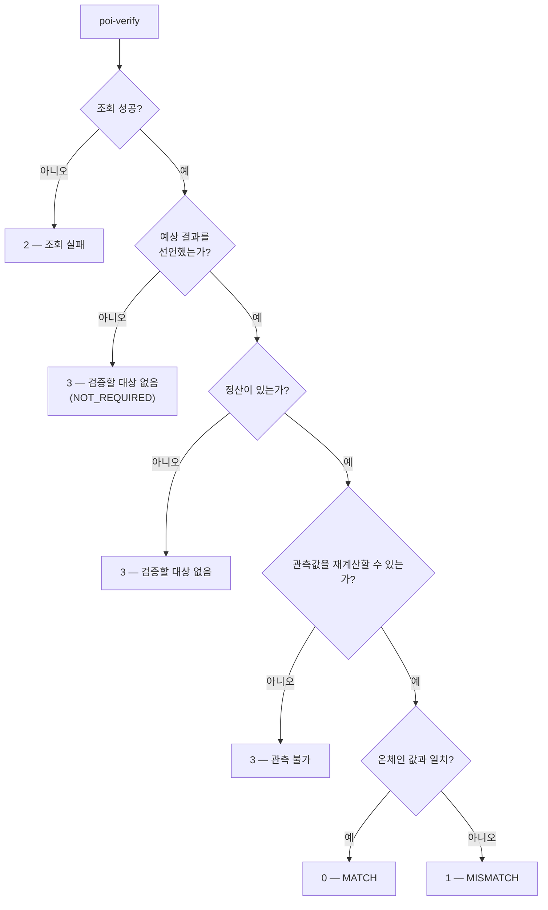

# 종료코드의 의미

| 종료코드 | 뜻 |
|---|---|
| 0 | `MATCH` — 온체인 정산 또는 공개 내용이 재계산과 일치 |
| 1 | `MISMATCH` — 일치하지 않음 |
| 2 | 조회·입력 실패 |
| 3 | 검증할 대상 없음 (예상 결과 미선언 · 미정산 · 관측 불가) |

`3`을 `0`으로 두면 "검증됨"과 구별되지 않고, `1`로 묶으면 "틀림"과
뭉개집니다. **검증하지 못한 것과 틀린 것은 다릅니다.**

## 판정 흐름

종료코드 `3`은 오류가 아니라 **아직 판정할 수 없다**는 상태를 따로 알리는 값입니다.
